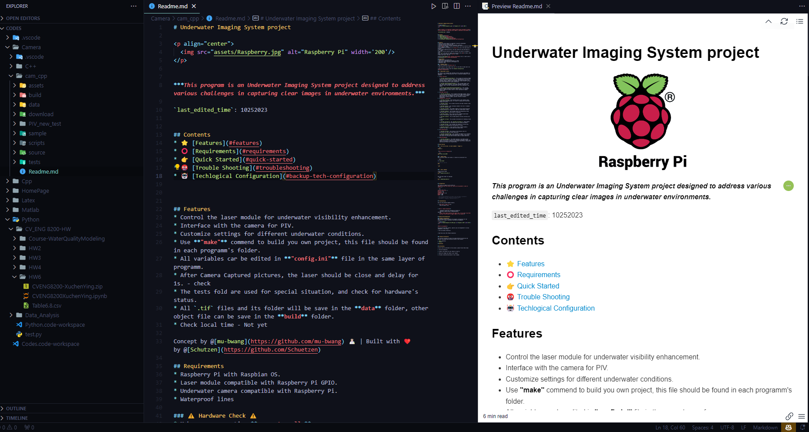
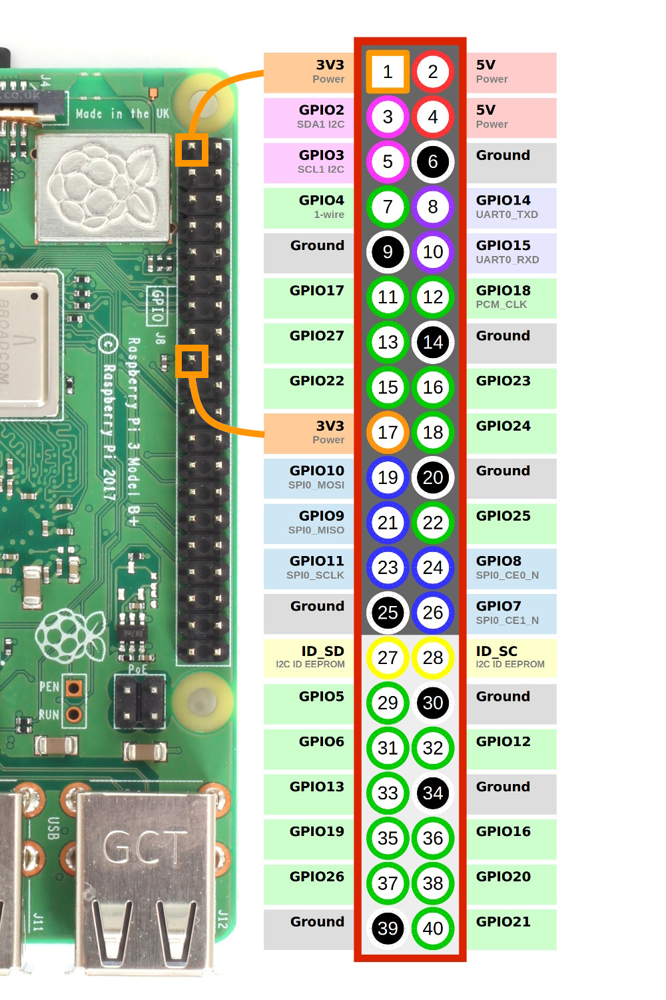
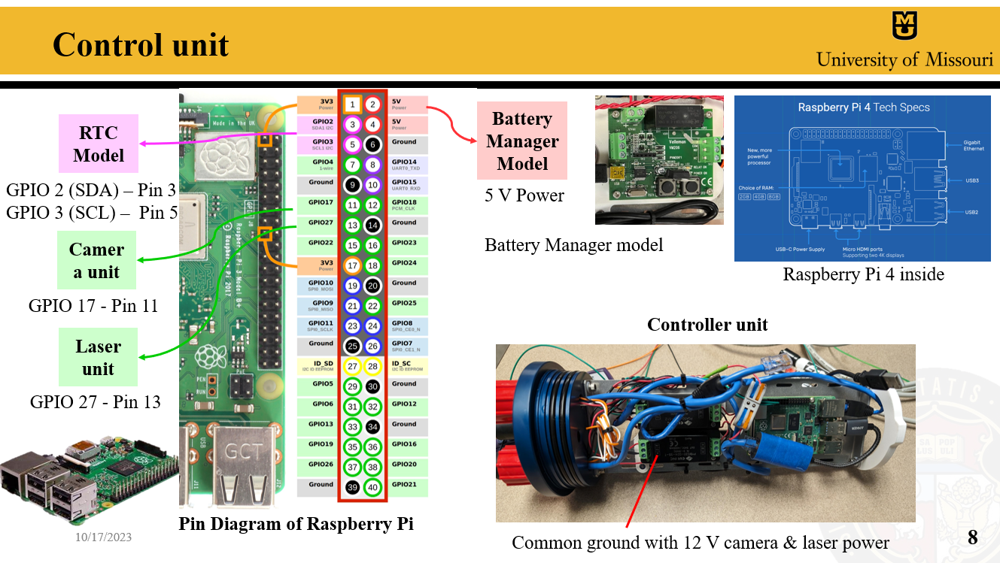

# Underwater Imaging System project

<p align="center">
  
</p>

## Overview
This project develops an Underwater Imaging System using a Basler camera, a laser module, the Pylon API, and the WiringPi library. It's designed for precise synchronization between image captures and laser signals, beneficial in Particle Image Velocimetry (PIV) systems and similar applications.


_Last Edited: Dec-07-2023_


## Table of Contents

1. **[Features](#features)**
2. **[Requirements](#requirements)**
3. **[Installation](#installation)**
4. **[Quick Start](#quick-start)**
5. **[Configuration](#configuration)**
6. **[Troubleshooting](#troubleshooting)**
7. **[Hardware Configuration](#hardware-configuration)**
8. **[Contributing](#contributing)**
9. **[References](#references)**


<p align="center">
  
</p>


## Features
* Basler camera control via Pylon API.
* Laser pulse synchronization using WiringPi.
* Camera settings configurable through `config.ini`.
* Image saving in TIFF format with operation logging.

Concept by @[mu-bwang](https://github.com/mu-bwang) 👩🏻‍🔬 | Built with ❤️ by @[Schutzen](https://github.com/Schuetzen)

## Requirements
* Basler camera (Pylon API compatible).
* Raspberry Pi (for GPIO control and laser sync).
* Pylon SDK.
* WiringPi library (Raspberry Pi users).
* C++11 or later development environment.

## Installation
1. **Pylon SDK**: Install from Basler website.
2. **WiringPi** (Raspberry Pi): Run `sudo apt-get install wiringpi`.
3. **Clone Repository**: `git clone [repository URL]`.
4. **Build**: Navigate to directory and compile:
    
    ```bash
    g++ -o camera_control main.cpp -lpylon -lwiringPi -lpthread
    ```

### ⚠️ Checks 
* **Software**: Validate Pylon SDK and WiringPi installation, GPIO configuration, C++11 compatibility.
* **Hardware**: Ensure connections, power supply (18V - 24V), and camera settings are correct.
 
### 🔗 libraries

* **Pylon**: For camera operations (`<pylon/PylonIncludes.h>`, `<pylon/ParameterIncludes.h>`, `<pylon/BaslerUniversalInstantCamera.h>`).
* **WiringPi**: GPIO control (`<wiringPi.h>`).
* **Standard C++ Libraries**: General functionalities.

## Quick Start

### 1. **Trigger on Laser**: 
Use bash commands or manually (`sudo screen /dev/nACM0`).

### 2. **Run Software**:

```bash
cd cam_cpp/src
make
cd ../bin
./piv
```

### 3. **Maintenance Commands**: 
For data folder cleanup and general maintenance.

## Configuration

Edit the `config.ini` file with specific parameters like exposure time, frequency, dimensions, etc., adhering to the provided format and rules.

## Troubleshooting

Here are the problems happend normally.

*  **The laser's light is low**

    Check the power first

* **Error: Timeout Exception**

    `terminate called after throwing an instance of 'GenICam_3_1_Basler_pylon::TimeoutException'
Aborted` 
    **This reason might caused by the camera buffer, this might happen in the first time running codes**

* **error while loading shared libraries: libVimbaCPP.so: cannot open shared object file: No such file or directory**

  `export LD_LIBRARY_PATH=/opt/Vimba_5_0/VimbaCPP/DynamicLib/arm_32bit:$LD_LIBRARY_PATH$`

* **error while loading shared libraries: libPvAPI.so: cannot open shared object file: No such file or directory**

  `export LD_LIBRARY_PATH="/home/pi/Desktop/AVT GigE SDK/bin-pc/arm/SF/:$LD_LIBRARY_PATH"`


## Hardware Configuration

Details GPIO pin assignments for Raspberry Pi 4, including connections for the camera, laser, and RTC module.

<p align="center">
  
</p>


*GPIO Pin Assignments*

Utilizing the WiringPi library, specific pins are designated for various components in this setup:

* Laser and Camera Connection:

**GPIO 17 (Pin 11)** - **Camera unit**
**GPIO 27 (Pin 13)** - **Laser unit**

* Real-Time Clock (RTC) Module Connection:

**GPIO 2 SDA (Pin3)** - **RTC**
**GPIO 3 SCL (Pin5)** - **RTC**

<p align="center">
  
</p>


### Script Architecture

Explains data flow and purpose of different directories (`data`, `assets`, `build`, `bin`, `download`, `tests`, `sample`, `src`).


## Contributing

Guidelines for contributing, including forking, branching, making changes, and submitting pull requests.


## References

Links to user guides for Makefile, Pylon SDK, Bash, and Linux commands.

* [Make file](https://www.gnu.org/software/make/manual/html_node/Makefiles.html)
* [Pylon SDK](https://docs.baslerweb.com/pylonapi/cpp/pylon_programmingguide)
* [Bash](https://docs.baslerweb.com/pylonapi/cpp/pylon_programmingguide)
* [Linux](https://docs.rockylinux.org/books/admin_guide/03-commands/)
